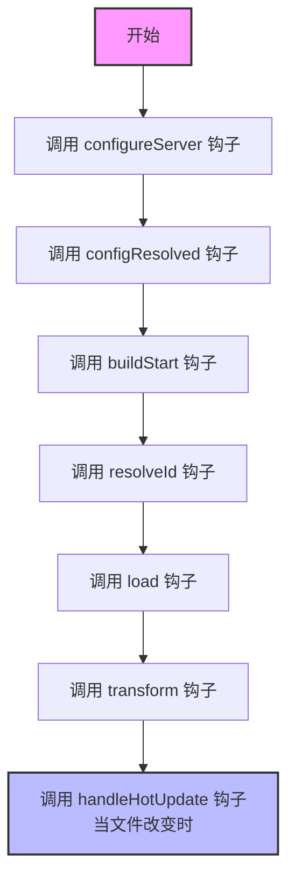

我将为您绘制 Vite 在开发模式（dev）下的钩子调用顺序流程图。

让我为您解释每个钩子的作用：

1. **configureServer**

   - 用于配置开发服务器
   - 可以添加自定义中间件
   - 访问内部服务器实例

2. **configResolved**

   - 在解析 Vite 配置后调用
   - 可以读取和修改最终配置

3. **buildStart**

   - 在服务器启动时调用
   - 可以进行初始化操作

4. **resolveId**

   - 用于解析模块导入路径
   - 可以自定义模块解析逻辑

5. **load**

   - 加载模块内容
   - 可以返回自定义的模块内容

6. **transform**

   - 转换模块代码
   - 可以对代码进行预处理或后处理

7. **handleHotUpdate**
   - 处理热更新
   - 在文件发生变化时触发
   - 可以自定义热更新行为

需要注意的是：

- `resolveId`、`load` 和 `transform` 钩子会在每个模块处理时重复调用
- `handleHotUpdate` 仅在开发模式下文件变更时触发
- 这些钩子可以是异步的，支持返回 Promise
