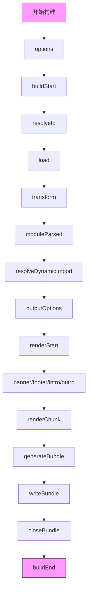

```js
让我为你解释一下主要钩子的执行顺序：

1. 构建初始化阶段
   - `options`: 配置初始化
   - `buildStart`: 开始构建

2. 文件处理阶段
   - `resolveId`: 解析模块ID
   - `load`: 加载模块内容
   - `transform`: 转换模块代码

3. 模块解析阶段
   - `moduleParsed`: 模块解析完成
   - `resolveDynamicImport`: 解析动态导入

4. 打包输出阶段
   - `outputOptions`: 输出配置
   - `renderStart`: 开始渲染
   - `banner/footer/intro/outro`: 添加包装代码
   - `renderChunk`: 渲染代码块
   - `generateBundle`: 生成打包文件
   - `writeBundle`: 写入文件

5. 构建结束阶段
   - `closeBundle`: 关闭打包
   - `buildEnd`: 构建结束

需要注意的是：
- 某些钩子（如 `resolveId`、`load`、`transform`）会对每个模块重复执行
- 有些钩子是并行执行的
- 错误处理钩子（如 `handleError`）可能在任何阶段触发
- `configResolved` 钩子在配置解析后、构建开始前执行
```
